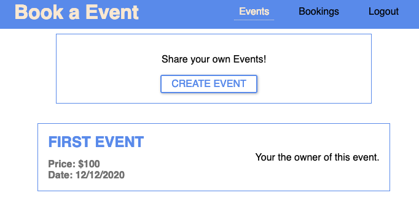

# Book a event

Create, read and book events

Screenshot

## 🙋 Before Getting Started You Should…

    1. Have some React and GraphQl knowledge.
    2. Have npm or yarn (or other package manager) set up on your computer.
    3. Have Node 8.10 or higher installed in computer.

## 🎯 Getting Started

 This is a open source project. Feel free to implement it or change it. 🔓

### 👉 Clone the repository to your machine 👈

You can use git or download it directly from github

### 👉 Get the dependencies 👈

Open your cloned folder. Then, using your favorite package manager get the dependencies.

Example using npm:

##### `$ npm install`

*You need to create a `.env` file and add it 2 variables: `SECRET= <secretkey>` and `DB=<mongoDB:conection>`*

#### 📋 Available Scripts 📋

In the project directory, you can run:

##### `$ npm run dev`
Runs webpack-devServer client in the development mode. Open [http://localhost:3000](http://localhost:3000/) to view it in the browser.

##### `$ npm run build:dev`
Builds the bundles to the `public` folder.

##### `$ npm run server:dev`
Runs the server in the development mode. Open [http://localhost:8000](http://localhost:8000/) to view it in the browser.

The page will reload if you make edits. You will also see any request in the console.

##### `$ npm run build`
Builds the app for production. 

### The app is ready to be deployed!
---

## 🏗️ Built With

- [React](https://reactjs.org/docs/getting-started.html) - The web framework used
- [GraphQL](https://graphql.org) - Query language for the API
- [Node.js](https://nodejs.org) - Backend tech used
- [Express](https://expressjs.com) - The server side framework used

## 🔢 Versioning

I use [SemVer](http://semver.org/) for versioning.
 **Current version: "1.0.0"**

## ✒️ Author

- **Efren Sanchez** - *Initial work* - [EfrenSanchez](https://github.com/EfrenSanchez)

## ©️ License

This project is licensed under the MIT License - see the [LICENSE.md](LICENSE.md) file for details.

## 🤗 Acknowledgments

- Hat tip to anyone 
